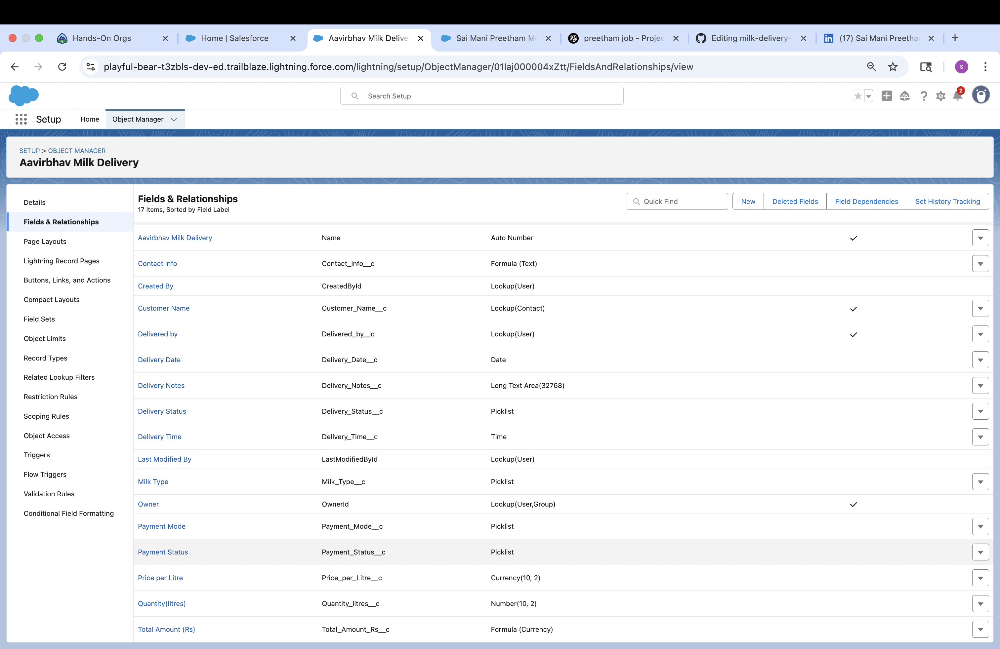
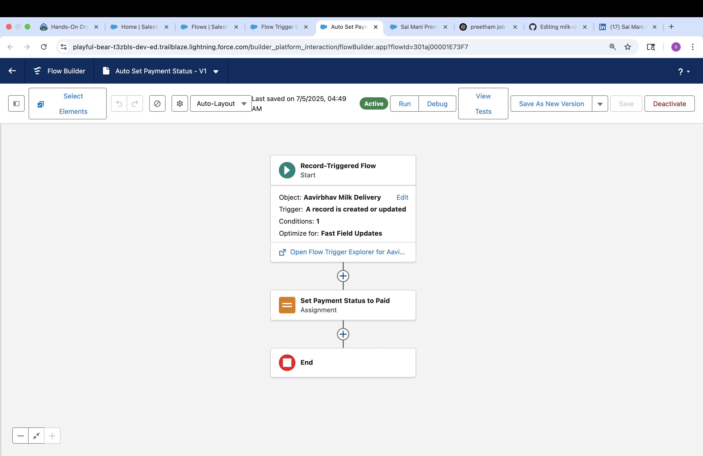
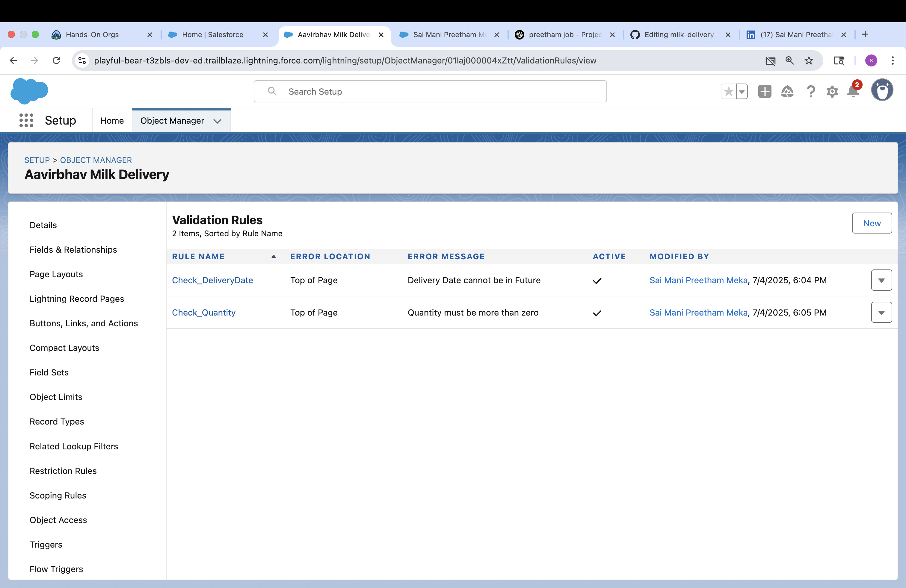

# milk-delivery-salesforce-app

A Salesforce CRM solution to track daily milk deliveries with automated validation using Flow and custom objects.

## 🚀 Project Summary

This project solves a real-world use case: daily delivery tracking for dairy businesses. Built entirely on Salesforce using declarative tools.

## 📌 Key Features

- ✅ Custom Object: Milk Delivery
- 👤 Lookup to Contact (Customer Name)
- 📆 Delivery Date, 📸 Image Upload, 📝 Delivery Notes
- ⚙️ Flow Builder to enforce photo upload
- 🔒 Validation Rules for clean record saving

## 🛠️ Tools Used

- Salesforce Object Manager  
- Flow Builder (Screen Flow & Record-Triggered)  
- Validation Rules  
- Page Layouts & Record Types  

## 📷 Screenshots

### Custom Object Fields  

### Flow Builder  

### Validation Rule  

## 🎓 Skills Practiced

- CRM Process Automation  
- Declarative App Development  
- Data Modeling  
- Business Logic Implementation  

## 📅 Completed: July 2025

## 🔗 Trailhead Link
[Milk Delivery App - Trailhead Project](https://trailhead.salesforce.com/)

